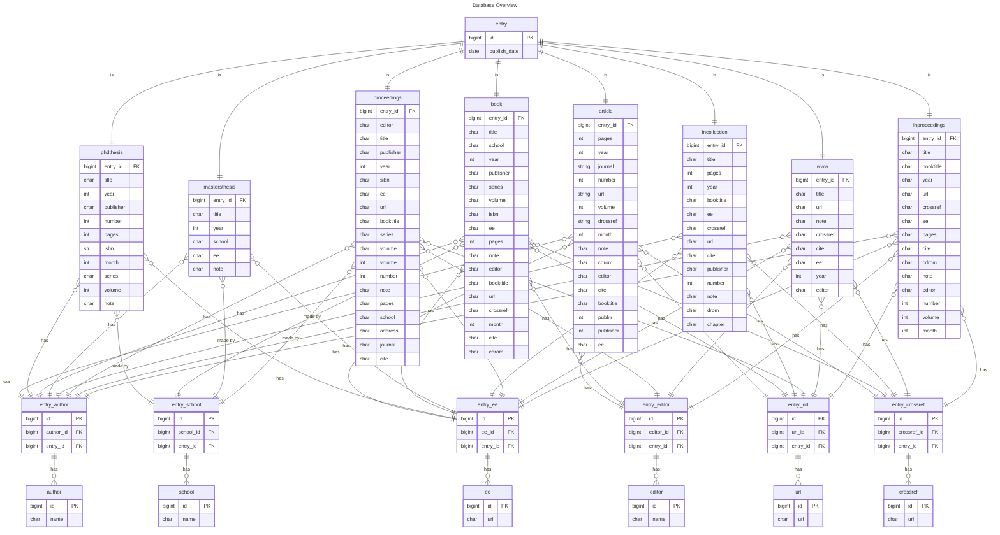

# Database dblp

This file gives an overview of the dblp PostgreSQL database.

## Code Snippets

### entry

```SQL
DROP TABLE IF EXISTS entry;

CREATE TABLE entry(
    id BIGINT GENERATED ALWAYS AS IDENTITY,
    publish_date date NOT NULL,
    key VARCHAR,
    PRIMARY KEY(id)
);
```

### phdthesis

```SQL
DROP TABLE IF EXISTS phdthesis;

CREATE TABLE phdthesis (
    id BIGINT GENERATED ALWAYS AS IDENTITY,
    entry_id BIGINT NOT NULL,
    title VARCHAR,
    year INT,
    month INT,
    publisher VARCHAR,
    number INT,
    pages INT,
    isbn VARCHAR,
    series VARCHAR,
    volume INT,
    note VARCHAR,
    PRIMARY KEY (id),
    CONSTRAINT fk_entry
        FOREIGN KEY(entry_id) 
        REFERENCES entry(id)
);
```

### author

```SQL
DROP TABLE IF EXISTS author;

CREATE TABLE author (
    id BIGINT GENERATED ALWAYS AS IDENTITY,
    name VARCHAR,
    PRIMARY KEY (id)
);
```

### entry_author

```SQL
DROP TABLE IF EXISTS entry_author;

CREATE TABLE entry_author (
    id BIGINT GENERATED ALWAYS AS IDENTITY,
    author_id BIGINT,
    entry_id BIGINT,
    PRIMARY KEY (id),
    CONSTRAINT fk_entry
        FOREIGN KEY(entry_id) 
        REFERENCES entry(id),
    CONSTRAINT fk_author
        FOREIGN key(author_id)
        REFERENCES author(id)
);
```

### ee

```SQL
DROP TABLE IF EXISTS ee;

CREATE TABLE ee (
    id BIGINT GENERATED ALWAYS AS IDENTITY,
    url VARCHAR,
    PRIMARY KEY(id)
);
```

### entry_ee

```SQL
DROP TABLE IF EXISTS entry_ee;

CREATE TABLE entry_ee (
    id BIGINT GENERATED ALWAYS AS IDENTITY,
    ee_id BIGINT,
    entry_id BIGINT,
    PRIMARY KEY (id),
    CONSTRAINT fk_entry
        FOREIGN KEY(entry_id) 
        REFERENCES entry(id),
    CONSTRAINT fk_ee
        FOREIGN key(ee_id)
        REFERENCES ee(id)
);
```


## Multiple Instances

+ cdrom: `str`
+ cite: `str`
+ publisher: `str`
+ author: `str` => Done
+ note: `str`
+ school: `str` => Done
+ editor: `str` => Done
+ url: `str` or `url` => Done
+ ee: `str` or `url` => Done
+ crossref: `str` or `url` => Done

## ERD


